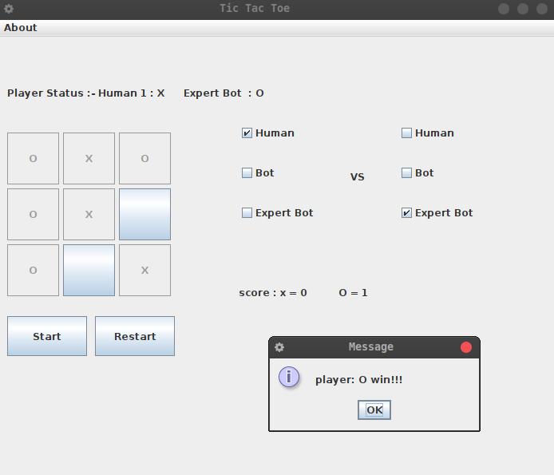

# Tic-Tac-Toe-
# i do not recommend the code style i followed here. i had created this when i was new to java and cs 
<div align="center">
  
</div>

```bash
    Take a look at the license and help improve the project
	
    HOW TO RUN THIS PROJECT :
    # change directory to codebase
    $ javac tic_tac_v2.java
    $ java tic_tac_v2
```
